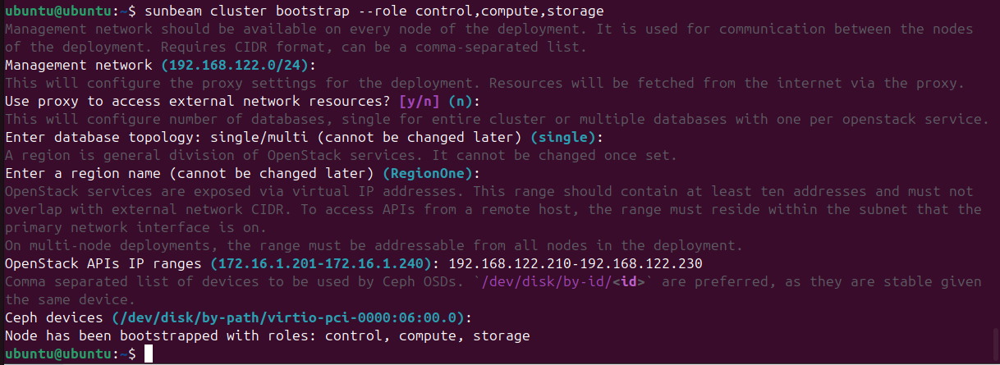
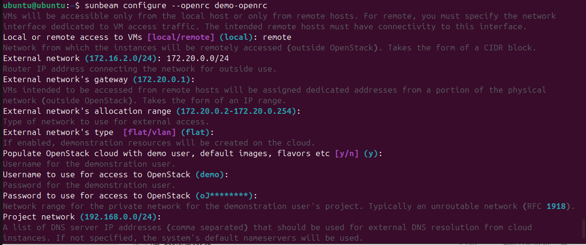
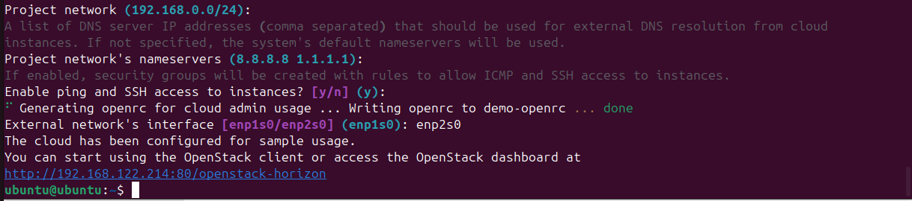
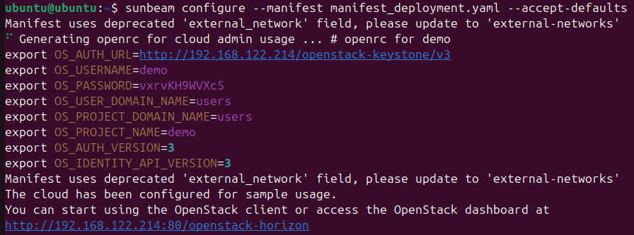
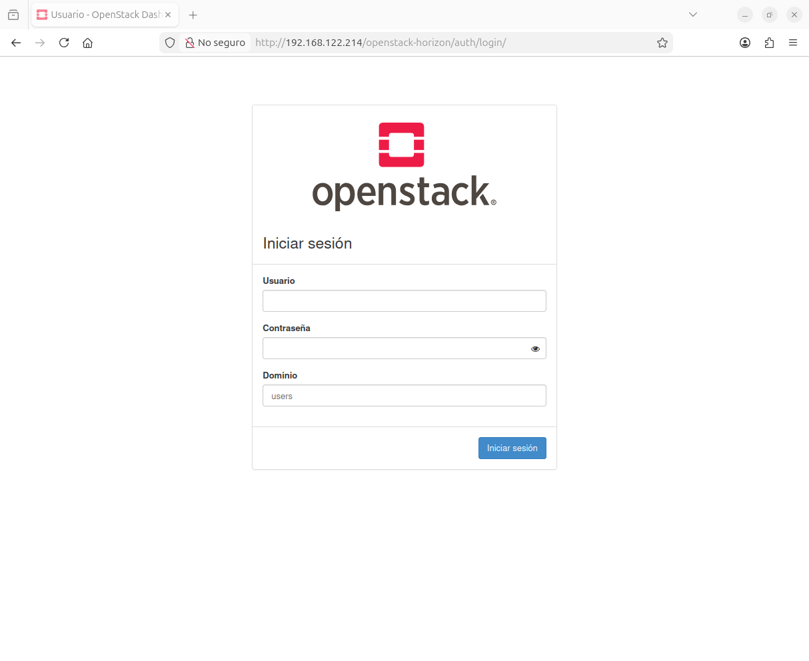
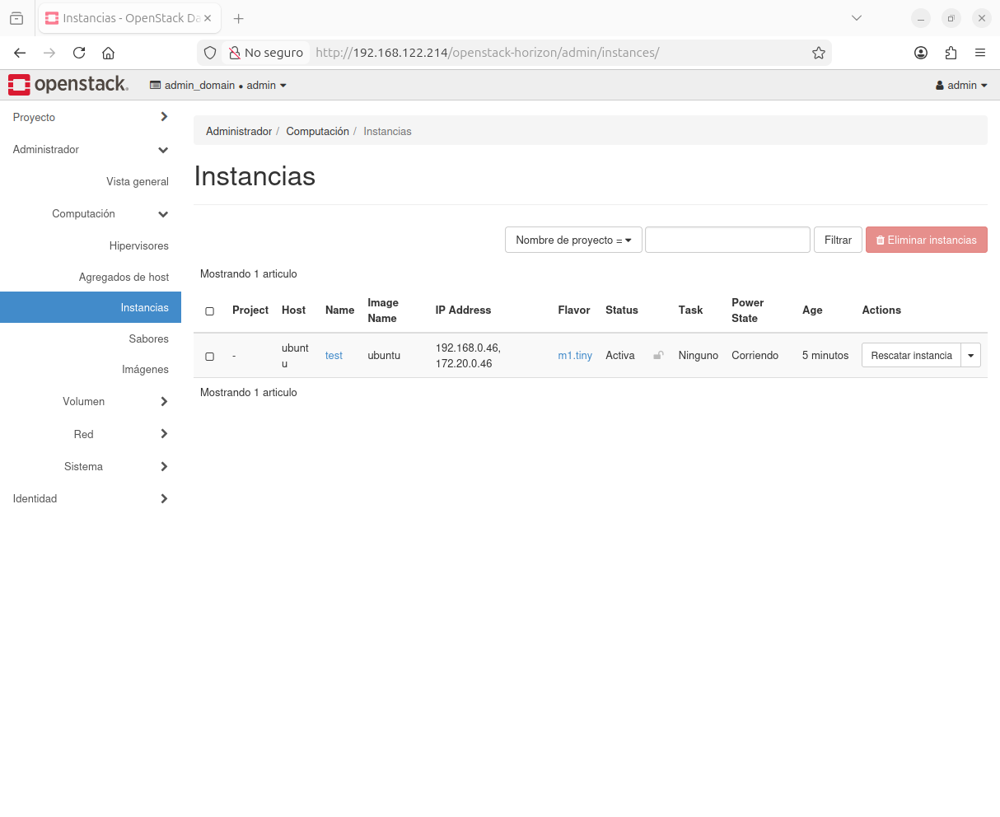

# Cómo desplegar OpenStack con Sunbeam en una VM de nodo único

###### Por Juan Manuel Payán Barea / jpaybar

st4rt.fr0m.scr4tch@gmail.com

---

## 📌 Descripción general

Este proyecto proporciona un laboratorio completamente automatizado para desplegar OpenStack usando Sunbeam en una máquina virtual Ubuntu de nodo único corriendo sobre KVM.

Incluye el provisionamiento de la VM, la preparación del sistema y el despliegue de OpenStack mediante un enfoque reproducible y basado en scripts.

El objetivo es simplificar el proceso de instalación ofreciendo a la vez un entorno práctico para aprendizaje, pruebas y experimentación.

---

## 🧪 Entorno

El laboratorio ha sido probado con la siguiente configuración:

### 🖥️ Sistema anfitrión

- SO: Ubuntu 24.04
- CPU: AMD Ryzen 5 3600 (6 núcleos)
- RAM: 32 GB
- Almacenamiento: SSD NVMe
- Red: Ethernet / Wi-Fi

### ⚙️ Virtualización

- Hipervisor: KVM (libvirt)
- Red: Red por defecto de libvirt + enrutamiento personalizado mediante hook de libvirt (acceso por IP flotante)

### 💻 Máquina virtual

- SO: Ubuntu Server 24.04
- vCPU: 8
- RAM: 20 GB
- Discos: 2 × 200 GB
- Interfaces de red: 2 (gestión + externa)
- Cloud-init habilitado

### ☁️ Despliegue OpenStack

- Plataforma: OpenStack (2024.1 - Caracal)
- Método: Sunbeam (nodo único)
- Despliegue: Basado en manifiesto + scripts automatizados

---

## 🌐 Topología de red

Esta configuración usa una red dual para habilitar el acceso externo a las instancias de OpenStack mediante IPs flotantes.

```
Red física (192.168.1.0/24)
        |
        |
Anfitrión (192.168.1.155)
        |
        |
Hipervisor KVM (libvirt)
virbr0 NAT -> 192.168.122.1
        |
        |
VM OpenStack
----------------------------------------
enp1s0 -> 192.168.122.250 (gestión)
enp2s0 -> sin IP (externa)
----------------------------------------
        |
        |
br-ex (bridge externo Neutron)
172.20.0.1
        |
        |
Red flotante (172.20.0.0/24)
        |
        | DNAT (Neutron)
        |
Instancia OpenStack
192.168.0.X
```

---

## ⚙️ Flujo de despliegue

El proceso de despliegue está completamente automatizado y sigue una secuencia estructurada:

1. **Preparación del anfitrión**
   
   - Configurar red y enrutamiento
   - Generar claves SSH y configuración
   - Aplicar hook de libvirt para acceso por IP flotante

2. **Provisionamiento de la VM**
   
   - Crear y configurar la máquina virtual (KVM)
   - Adjuntar discos e interfaces de red
   - Inyectar configuración cloud-init

3. **Bootstrap de OpenStack**
   
   - Inicializar el clúster Sunbeam
   - Preparar los servicios base

4. **Configuración de OpenStack**
   
   - Aplicar el manifiesto de despliegue
   - Configurar red, almacenamiento y servicios

5. **Validación**
   
   - Acceder al panel Horizon
   - Lanzar instancia de prueba
   - Verificar conectividad externa mediante IP flotante

---

## 🚀 Inicio rápido

Sigue estos pasos para desplegar OpenStack con este proyecto:

### 1. Clonar el repositorio

```
git clone https://github.com/jpaybar/sunbeam_openstack_deployment.git
cd sunbeam_openstack_deployment
```

### 2. Ejecutar el script de despliegue

```
bash scripts/main.sh
```

### 3. Esperar a que el proceso termine

El script automáticamente:

- Prepara el entorno del anfitrión
- Crea y configura la máquina virtual
- Despliega OpenStack usando Sunbeam
- Aplica la configuración del manifiesto

### 4. Acceder a OpenStack

Una vez completado el despliegue:

- Acceder al panel Horizon desde el navegador
- Usar las credenciales generadas
- Lanzar una instancia de prueba

### 5. Verificar conectividad

- Asignar una IP flotante
- Probar acceso externo (SSH / ping)

---

## 📂 Estructura del proyecto

El repositorio está organizado para separar scripts de automatización, ficheros de configuración y recursos de apoyo:

```
.
├── docs/
│   └── notes.md
│
├── pics/
│   ├── 01_cluster_bootstrap.png
│   ├── 02_sunbeam_configure_step1.png
│   ├── 03_sunbeam_configure_step2.png
│   ├── 04_deployment_complete.png
│   ├── 05_horizon_dashboard.png
│   └── 06_test_instance.png
│
├── scripts/
│   ├── host_config.sh        # Preparación del anfitrión (SSH, enrutamiento, hook libvirt)
│   ├── main.sh               # Script principal de orquestación
│   └── vm_deployment.sh      # Creación y configuración de la VM (KVM/libvirt)
│
├── manifest_deployment.yaml  # Manifiesto de despliegue de Sunbeam
├── user-data.template.yaml   # Plantilla cloud-init (inyección de clave SSH)
│
└── README.md
```

### 🔧 Descripción de los scripts

- **main.sh**
  Punto de entrada del proyecto. Orquesta el flujo de despliegue completo.

- **host_config.sh**
  Prepara el sistema anfitrión:
  
  - Generación y configuración de claves SSH
  - Configuración de red
  - Enrutamiento personalizado mediante hook de libvirt (acceso por IP flotante)

- **vm_deployment.sh**
  Gestiona el provisionamiento de la máquina virtual:
  
  - Creación de la VM con KVM/libvirt
  - Configuración de discos y red
  - Inyección de cloud-init usando la plantilla

### 📁 Otros componentes

- **manifest_deployment.yaml**
  Define la configuración de despliegue de OpenStack utilizada por Sunbeam.

- **user-data.template.yaml**
  Plantilla cloud-init usada para configurar la VM dinámicamente (p. ej., inyección de clave SSH).

- **pics/**
  Contiene capturas de pantalla del proceso de despliegue y los pasos de validación.

- **docs/**
  Notas adicionales y referencias relacionadas con el laboratorio.

---

## ⚠️ Notas importantes (antes de empezar)

Antes de ejecutar el despliegue, asegúrate de revisar lo siguiente:

- **Directorio de imágenes de la VM (libvirt)**
  
  Ruta por defecto (no usada en este proyecto):
  
  ```
  /var/lib/libvirt/images/
  ```
  
  Ruta personalizada usada en este laboratorio:
  
  ```
  /var/lib/libvirt/user-images/openstack/
  ```
  
  Este enfoque ayuda a:
  
  - Mantener las imágenes relacionadas con OpenStack aisladas
  - Evitar conflictos con el almacenamiento por defecto de libvirt
  - Mejorar la organización y mantenibilidad

- **Requisitos de tamaño de disco**
  
  Este laboratorio está diseñado para funcionar con la siguiente configuración de disco:
  
  - Disco del sistema: **200 GB**
  - Disco de almacenamiento adicional: **200 GB**
  
  Si necesitas descargar y preparar la imagen base de Ubuntu:
  
  ```
  wget https://cloud-images.ubuntu.com/noble/current/noble-server-cloudimg-amd64.img
  ```
  
  Luego redimensionarla antes del despliegue:
  
  ```
  qemu-img resize noble-server-cloudimg-amd64.img 200G
  ```

👉 Detalles adicionales y explicaciones disponibles en:
docs/notes.md

---

## 🚀 Despliegue de OpenStack (ejecución del laboratorio)

### ✅ Comandos usados en este laboratorio (despliegue automatizado)

El despliegue de OpenStack en este laboratorio se ejecuta mediante un **enfoque automatizado basado en manifiesto**:

```bash
sudo snap install openstack

sunbeam prepare-node-script --bootstrap | bash -x && newgrp snap_daemon

sunbeam cluster bootstrap \
  --role control,compute,storage \
  --manifest manifest_deployment.yaml \
  --accept-defaults

sunbeam configure \
  --manifest manifest_deployment.yaml \
  --accept-defaults

sunbeam openrc > admin-openrc

source admin-openrc

sunbeam launch ubuntu --name test
```

💡 Este enfoque garantiza:

- Despliegue completamente reproducible
- Sin interacción manual requerida
- Configuración consistente usando `manifest_deployment.yaml`

---

## 📸 Referencia: Despliegue manual / interactivo (para entender el proceso)

> ⚠️ Las siguientes capturas corresponden a un **despliegue manual (interactivo)**,
> incluidas con fines educativos para entender qué automatiza el manifiesto.

---

### 🔧 Bootstrap del clúster (interactivo)



💡 En modo manual, este paso solicita:

- Red de gestión (CIDR)
- Rangos de IPs para la API
- Dispositivos de almacenamiento (Ceph)
- Roles del nodo

👉 En este laboratorio, todo esto está definido en el **manifiesto**, por lo que no aparece ningún prompt.

---

### 🌐 Configuración de OpenStack (interactivo)





💡 La configuración manual incluye:

- Definición de la red externa
- Gateway y rangos de asignación
- Creación de usuario y proyecto de demo
- DNS y reglas de seguridad
- Mapeo de interfaces de red

👉 Todo gestionado automáticamente mediante el manifiesto en este laboratorio.

---

### ⚙️ Resultado del despliegue basado en manifiesto



💡 Esto es lo que obtienes realmente en este laboratorio:

- Sin preguntas
- Configuración directa desde el manifiesto
- Despliegue más rápido y reproducible

---

### 🌐 Panel Horizon



Acceso:

```
http://<OPENSTACK_VM_IP>/openstack-horizon
```

---

### 🖥️ Instancia de prueba



💡 Validación final:

- Instancia lanzada correctamente
- Red funcionando (interna + IP flotante)
- Cloud completamente operativo

---

## 🧠 Concepto clave

- **Modo interactivo** → Aprendizaje y depuración
- **Modo manifiesto (este laboratorio)** → Automatización y reproducibilidad

👉 El manifiesto es esencialmente una **versión declarativa de la configuración interactiva**

---

## 📚 Documentación oficial

Para información técnica detallada y configuración avanzada, consulta la documentación oficial de OpenStack Sunbeam:

🔗 https://canonical-openstack.readthedocs-hosted.com/en/latest/

---

### 🧠 Por qué es importante

- Proporciona explicaciones detalladas de cada servicio
- Cubre configuraciones avanzadas más allá de este laboratorio
- Útil para resolución de problemas y escenarios reales

---

👉 Este proyecto se centra en un **despliegue práctico y simplificado**,
mientras que la documentación oficial proporciona la **referencia técnica completa**

## 👤 Información del autor

**Juan Manuel Payán Barea**
Administrador de Sistemas | SysOps | Infraestructura IT

st4rt.fr0m.scr4tch@gmail.com

GitHub: https://github.com/jpaybar
LinkedIn: https://es.linkedin.com/in/juanmanuelpayan
